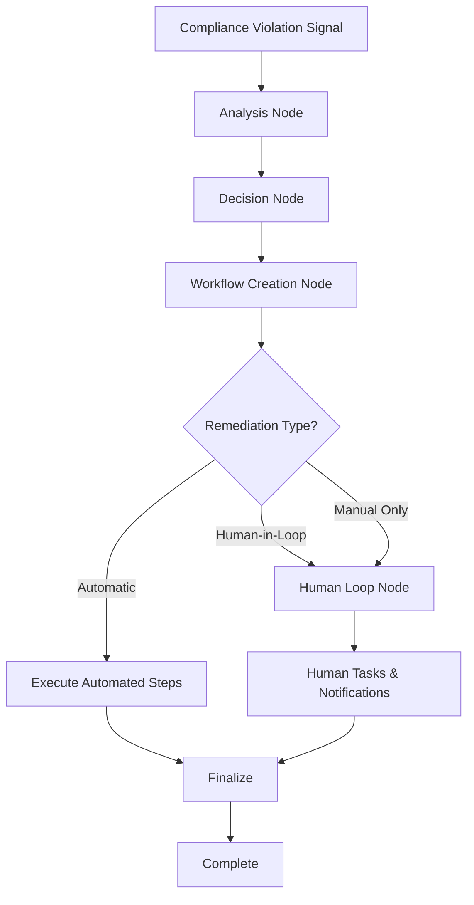

# AI-Powered Remediation Agent

A sophisticated AI-driven compliance remediation system that intelligently processes compliance violations and orchestrates automated and human-in-the-loop remediation workflows using LangGraph.

## Overview

The Remediation Agent is designed to receive signals from the compliance engine and automatically determine the best approach for remediation:

- **Automatic Remediation**: For simple, low-risk violations that can be safely automated
- **Human-in-the-Loop**: For complex violations requiring human oversight and approval
- **Manual Only**: For critical violations requiring full human intervention

## Architecture

```
src/remediation_agent/
├── agents/               # Intelligent decision-making agents
│   ├── decision_agent.py      # Determines remediation approach
│   ├── validation_agent.py    # Validates remediation feasibility
│   └── workflow_agent.py      # Creates and manages workflows
├── tools/                # Remediation tools and integrations
│   ├── sqs_tool.py            # AWS SQS queue management
│   ├── remediation_validator.py  # Validation utilities
│   └── notification_tool.py   # Human notification system
├── state/                # State management for workflows
│   ├── models.py              # Pydantic models
│   └── remediation_state.py   # LangGraph state management
├── graphs/               # LangGraph orchestration
│   ├── nodes/                 # Individual workflow nodes
│   │   ├── analysis_node.py   # Violation analysis
│   │   ├── decision_node.py   # Remediation decision
│   │   ├── workflow_node.py   # Workflow creation
│   │   └── human_loop_node.py # Human intervention
│   └── remediation_graph.py   # Main workflow orchestration
└── main.py               # Main agent entry point
```

## Key Features

### 🧠 Intelligent Decision Making
- AI-powered analysis of compliance violations
- Automatic complexity assessment
- Feasibility scoring for automated remediation
- Context-aware decision making with confidence scoring

### 🔄 LangGraph Workflow Orchestration
- Sophisticated workflow routing based on violation characteristics
- Conditional logic for automatic vs. human intervention
- State persistence and resumable workflows
- Error handling and retry mechanisms

### ⚙️ AWS SQS Integration
- Automatic creation of SQS queues for workflow management
- Message-driven workflow execution
- Dead letter queues for error handling
- Queue monitoring and statistics

### 👥 Human-in-the-Loop Capabilities
- Intelligent task creation for human intervention
- Multi-channel notification system (email, Slack, SMS, webhooks)
- Deadline tracking and reminder scheduling
- Approval workflows for high-risk remediation

### 📊 Comprehensive Monitoring
- Real-time workflow status tracking
- Detailed execution metrics and analytics
- Performance monitoring and optimization
- Emergency stop capabilities

## Workflow Process



## Usage Examples

### Basic Usage

```python
from src.remediation_agent.main import RemediationAgent
from src.compliance_agent.models.compliance_models import (
    ComplianceViolation, DataProcessingActivity, DataType, RiskLevel
)

# Initialize the agent
agent = RemediationAgent()

# Create violation and activity objects
violation = ComplianceViolation(
    rule_id="gdpr_art17_violation_001",
    activity_id="user_data_001",
    description="User requested data deletion",
    risk_level=RiskLevel.HIGH,
    remediation_actions=["Delete user data", "Verify deletion"]
)

activity = DataProcessingActivity(
    id="user_data_001",
    name="User Profile Management",
    purpose="Account management",
    data_types=[DataType.PERSONAL_DATA],
    legal_bases=["consent"]
)

# Process the violation
result = await agent.process_compliance_violation(
    violation=violation,
    activity=activity,
    framework="gdpr_eu"
)

print(f"Success: {result['success']}")
print(f"Remediation Type: {result['decision_info']['remediation_type']}")
```

### Batch Processing

```python
# Process multiple violations concurrently
violations_data = [
    {"violation": violation1, "activity": activity1, "framework": "gdpr_eu"},
    {"violation": violation2, "activity": activity2, "framework": "pdpa_singapore"}
]

batch_result = await agent.process_multiple_violations(
    violations_data,
    max_concurrent=5
)

print(f"Processed: {batch_result['total_processed']}")
print(f"Success Rate: {batch_result['success_rate']:.2%}")
```

## Decision Logic

The remediation agent uses sophisticated logic to determine the appropriate remediation approach:

### Automatic Remediation Criteria
- Feasibility score ≥ 0.7
- Complexity score ≤ 0.6
- Confidence score ≥ 0.8
- Risk level ≤ Medium

### Human-in-Loop Criteria
- Feasibility score ≥ 0.4
- Complexity score ≤ 0.8
- Confidence score ≥ 0.6
- Risk level ≤ High

### Manual Only (Default)
- Any criteria not met above
- Critical risk levels
- Complex regulatory requirements

## Configuration

The agent can be configured through environment variables or configuration files:

```python
agent.config = {
    "max_concurrent_workflows": 10,
    "default_timeout_hours": 72,
    "enable_notifications": True,
    "auto_retry_failed_workflows": True,
    "max_retry_attempts": 3
}
```

## Supported Compliance Frameworks

- GDPR (EU General Data Protection Regulation)
- PDPA (Singapore Personal Data Protection Act)
- CCPA (California Consumer Privacy Act)
- PIPEDA (Canada Personal Information Protection)
- LGPD (Brazil Lei Geral de Proteção de Dados)

## Monitoring and Metrics

### Real-time Metrics
- Total violations processed
- Success rates by remediation type
- Average resolution times
- Error rates and failure analysis

### Workflow Monitoring
- Active workflow status
- Step completion tracking
- SQS queue statistics
- Human task progress

### Performance Analytics
- Execution time analysis
- Resource utilization
- Bottleneck identification
- Optimization recommendations

## Error Handling

The system includes comprehensive error handling:

- **Automatic Retries**: Failed steps are automatically retried with exponential backoff
- **Circuit Breakers**: Prevent cascading failures in external systems
- **Graceful Degradation**: Falls back to human intervention when automation fails
- **Emergency Stop**: Ability to immediately halt any workflow

## Security Considerations

- **Data Privacy**: All processing respects data protection requirements
- **Access Control**: Role-based access for human intervention tasks
- **Audit Logging**: Comprehensive audit trail for all actions
- **Encryption**: All data in transit and at rest is encrypted

## Future Enhancements

- Machine learning-based decision optimization
- Advanced workflow templates
- Integration with more compliance frameworks
- Real-time compliance monitoring dashboard
- Automated compliance reporting

## Dependencies

- **LangGraph**: Workflow orchestration
- **LangChain**: AI agent framework
- **Pydantic**: Data validation and modeling
- **AWS SDK**: SQS integration
- **FastAPI**: REST API framework

## Getting Started

1. Install dependencies: `pip install -r requirements.txt`
2. Configure AWS credentials for SQS integration
3. Set up OpenAI API key for AI agent functionality
4. Run the example: `python examples/remediation_agent_example.py`

## API Documentation

The remediation agent provides a REST API for integration with other systems. See the main compliance agent API documentation for endpoint details.

---

Built with ❤️ for intelligent compliance automation.